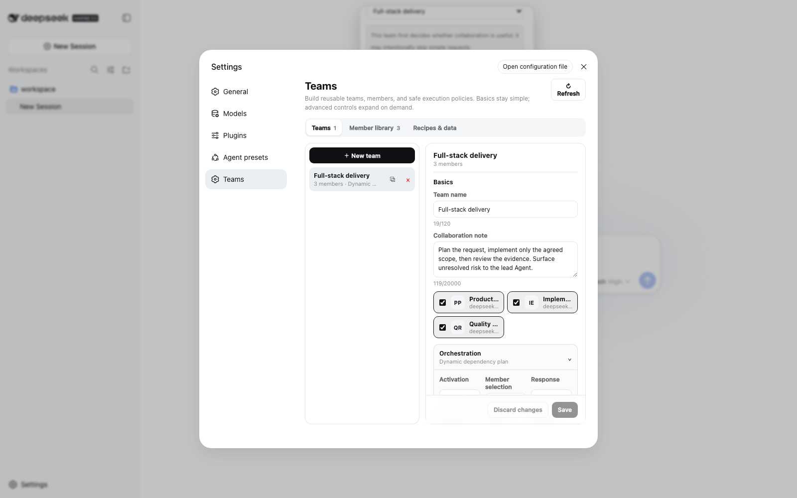
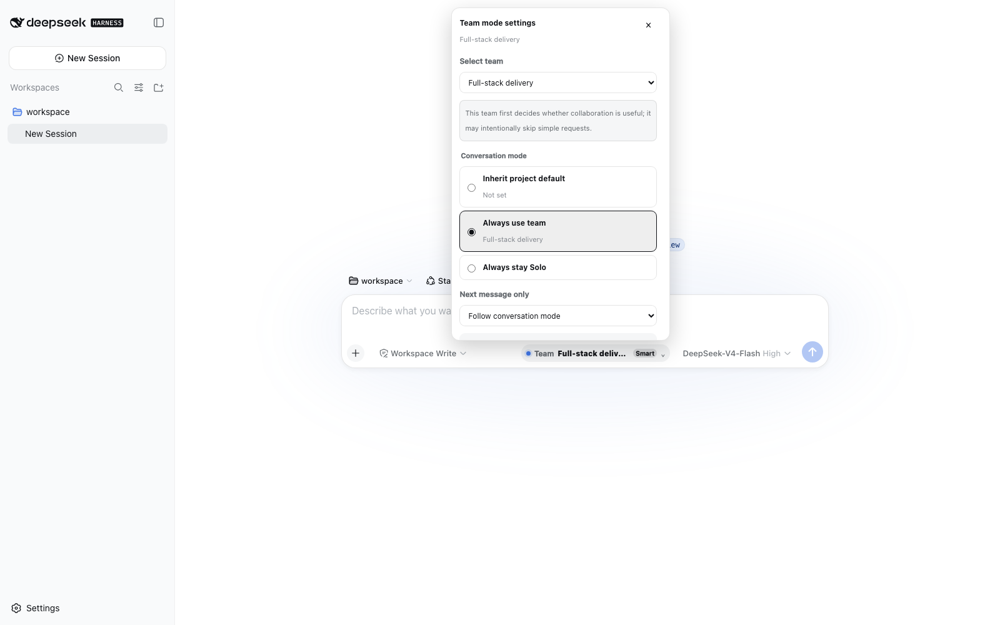
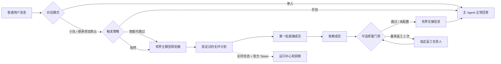
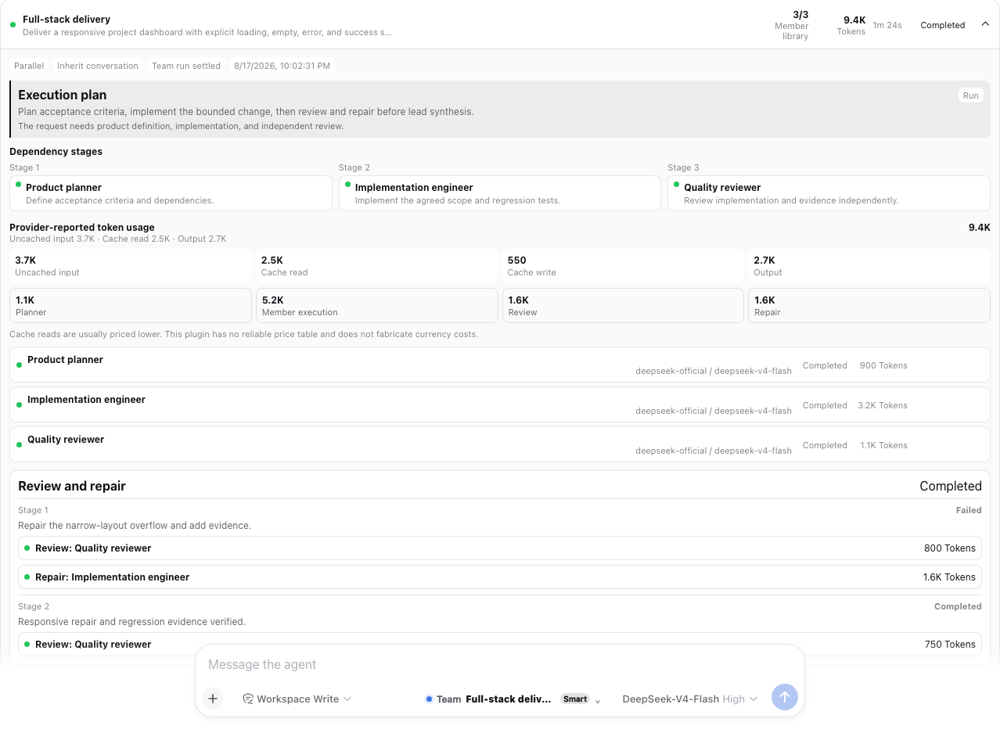
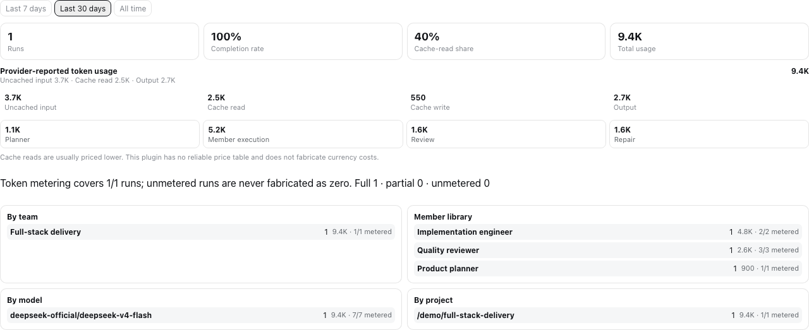
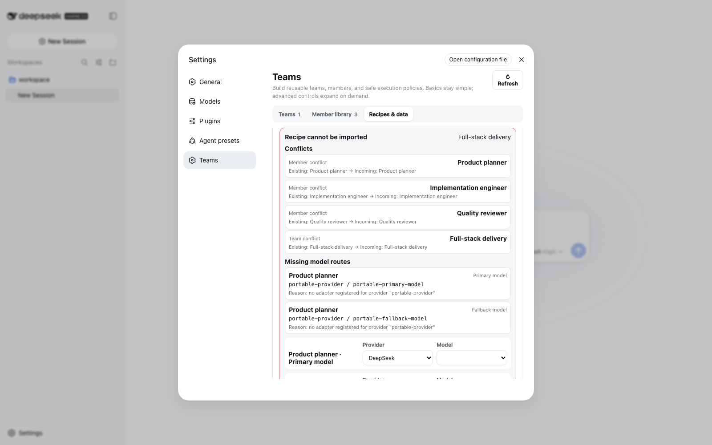
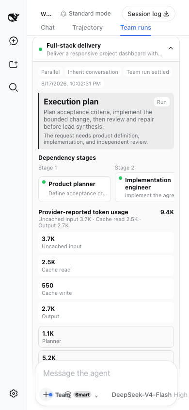

# dsh-agent-team-gui

[English](README.md) | [简体中文](README-zh.md)

[](https://github.com/toolclub/dsh-agent-team-gui/actions/workflows/ci.yml)
[](https://github.com/toolclub/dsh-agent-team-gui/releases)
[](https://github.com/toolclub/dsh-agent-team-gui/stargazers)
[](LICENSE)

**为 [DeepSeek Harness](https://github.com/deepseek-ai/deepseek-harness) 提供持久、可复用的多模型 Agent 小队。**
每个成员都能独立配置模型、角色、备用路由、Token 上限和工具策略。在普通对话输入框旁选择
已保存的小队；主模型会拆分工作、执行有界依赖图，最后综合结果。



## 为什么需要这个插件

小队是可以长期复用的产品对象，不是一次性的派单表单。在 **Settings → 小队** 中创建一次，
以后可以跨项目、跨对话使用。

| 能力 | 给用户带来的价值 |
| --- | --- |
| 每个成员独立模型和工具策略 | 规划、实现、审核或领域专家可以使用不同路由，不必共用一套配置 |
| 默认动态工作流编排 | 当前对话的模型根据这次请求，为成员生成聚焦任务和依赖关系 |
| 小队 / 单人 / 继承三态 | 清楚地区分对话覆盖、项目默认和仅下一条消息的临时选择 |
| 有界 DAG、重试、质量门禁、后台运行 | 长任务可观察、可取消、不会无限递归，重启后也有明确状态 |
| 官方 Provider Token 用量 | 查看输入、缓存读取、缓存写入和输出，并明确完整/部分/无计量，绝不伪造价格 |
| 版本、配方和定义备份 | 可复现、无凭证分享、应用前预览影响，并先重映射模型路由 |

## 安装

前置条件：DeepSeek Harness `>=0.1.0-rc.5 <0.2.0`、**Web** profile、Node.js
`>=22.19.0 <23` 或 `>=24.0.0`（不支持 Node.js 23）、pnpm，以及至少一条已经配置好的
DSH provider/model 路由。

```sh
dsh plugin --profile web add -w github:toolclub/dsh-agent-team-gui#v1.0.1
dsh --profile web
```

Git 依赖会执行仓库自带的 `prepare` 构建。pnpm 10 或更高版本第一次可能要求授权构建。
只把这个已经审查过的包加入 pnpm 提示的 Web profile 文件（通常是
`~/.dsh/profiles/web/pnpm-workspace.yaml`），然后重复同一条固定版本命令：

```yaml
allowBuilds:
  dsh-agent-team-gui: true
```

如果 DSH Web 已经运行，安装或更新后必须重启进程。打开 **Settings → 小队**，创建或导入
成员和小队，然后打开对话输入框旁边的小队控件。

> [!TIP]
> 如果终端找不到 `dsh`，说明克隆 Harness 源码并不会自动安装全局命令。在 Harness 仓库中
> 使用 `pnpm dsh --version`，并把本文的 `dsh ...` 替换为
> `pnpm --dir /absolute/path/to/deepseek-harness dsh ...`。

不安装 `rg` 也能检查组合后的 bundle：

```sh
dsh --profile web --dump-config | grep -E "agent-team-gui|dsh-agent-team-gui"
```

预期输出同时包含 `dsh-agent-team-gui` bundle 层和 `agent-team-gui` 行。

> [!CAUTION]
> `allowBuilds` 允许选中的 Git 依赖在你的机器上执行构建。请先审查源码，并固定 tag 或完整
> commit SHA。已经编译好的 release tarball 不需要 Git `prepare` 权限。

## 五步创建第一个小队

1. 在 **Settings → 成员库** 创建可复用成员。选择已经配置的 provider/model，写清楚单一
   角色提示词，可选备用路由，并且只授权这个角色需要的工具。
2. 在 **Settings → 小队** 创建小队并选择成员。不启用**固定顺序**时默认动态编排；启用后
   得到可重复的串行流水线。
3. 选择**始终 / 智能 / 手动**触发、全部成员或自适应子集、前台或后台，并按需配置恢复、
   预算和审核策略。
4. 在普通输入框旁选择**小队 / 单人 / 继承**。还可以只给下一条有效消息排队另一个小队或
   单人模式，或者设置项目默认小队。
5. 像平时一样发送消息。打开**小队运行**即可查看计划、阶段、成员、审核/返工轮次、输出、
   错误、耗时、重试和官方 Token 计量覆盖。



## 编排是怎样工作的



没有固定顺序时，插件会使用当前对话的 provider/model 路由启动一个有界、无工具的规划
子任务。它读取所有成员的角色，并返回结构化分工和无环依赖图。规划器不会让第一个成员替代
整个小队。计划不可用、无效或有环时，会回退到确定性的角色专属任务。

所有已就绪 DAG 节点最多按 `maxConcurrency` 并发执行；依赖成员只接收有界的结构化交接，
完整输出保存在持久运行历史中。固定成员顺序是明确的串行覆盖，它不会执行 DAG 规划。

### 触发和成员选择

- **始终**：每条有效的顶层用户消息都运行所选小队。
- **智能**：有界规划器可以跳过不适合或太简单的任务。
- **手动**：普通消息保持单人；可以只给下一条消息使用小队，或者让模型调用工具。
- **全部成员**：每个已配置成员恰好获得一次任务。
- **自适应**：智能规划选择最小但非空的合适成员子集。

### 对话模式

- **小队**：这个对话持久地显式使用某个小队。
- **单人**：这个对话持久地显式退出，即使项目设置了默认小队也不启用。
- **继承**：删除对话覆盖；如果项目有默认小队就跟随它。
- **下一条消息**：独立、崩溃安全的一次性小队或单人选择，只消费一次。

刷新页面、Host 冷启动和在线重连后，这些状态仍然可以立即操作。目录暂时为空或请求失败时，
插件不会擅自删除已经保存的选择。

### 安全边界

- 规划、成员、审核和返工提示词会把角色范围与禁止委派放在前面，用户内容只提供有界摘录。
- 被委派的 Session 不能再次派小队。插件会识别并禁止小队子成员中的 DSH subagent 工具，
  包括重命名后的注册项。
- 自动路径和模型工具共同使用“最新人类消息”的持久原子 claim；重复工具调用不会创建几百个
  重复小队。
- 成员超时、并发、一次重试、软 Token 预算和质量轮次都有明确上限。
- 重试会创建有链接的不可变运行，并重放原来的分工、顺序和 DAG，不会悄悄让模型重新发明流程。

## 运行中心和 Token 用量



每次执行都会在规划前写入持久记录。运行中心展示前台/后台状态、实时阶段、耗时、child ID、
完整输出、有界交接、停止、有链接的整次或单成员重试、导出、筛选以及受保留策略保护的清理。

如果 DSH 子运行在交付非空纯文本后以 `stopReason: "error"` 结束，该成员会按**已完成**处理，
不会把有效的长文本交付误判为失败。停止原因仍会持久化，运行中心会显示协议交付警告；空输出、
Promise 拒绝、清理失败、超时以及 `max-tokens` 等其他非完成原因仍然算失败。

每个成员的交接摘要默认最多保留 16,000 个字符。小队可通过 `handoffSummaryMaxChars` 配置
1,000–32,000 个字符。完整原始输出仍持久保存在运行中心；依赖成员和主模型 Prompt 继续使用
独立的聚合边界，避免单个长交付无限扩大模型上下文。

插件复用 DSH 官方 `tokenUsage` projection，并保留四个桶：

- 非缓存输入；
- 缓存读取；
- 缓存写入；
- 输出。

规划、成员、审核和返工用量可以分别归因。每次运行和重试尝试都明确显示**完整 / 部分 /
无计量**。Provider 第一次上报前，UI 显示**正在计量…**，不会显示假的 0。Token 不是金钱；
Harness provider 没有通过稳定价格契约发布价格时，插件不会猜测费用。



## 质量门禁和后台运行

可选质量门禁需要明确指定审核人、返工负责人、审核标准和 `0..2` 次返工。未通过时只能重跑
这个返工负责人，再交给指定审核人复查；它不能随意创建 Agent 或递归。

前台运行完成后，主 Agent 才综合有界交接。后台运行立即返回简短确认，并持续显示在插件运行
中心；如果 DSH 官方 Jobs service 存在，同一次运行也会注册到官方界面并共享取消逻辑。如果
缺少这个可选 service，插件使用进程内后台执行；Host 重启后，未完成记录会被统一标为
**已中断**，不会伪装成成功。

## 版本、配方和定义备份



- 每个小队版本都包含所有引用成员的不可变快照。
- 恢复前必须预览；共享成员会影响其他小队时会明确警告。
- 配方只包含一个小队及其成员，不包含 provider 凭证。导入支持**复制 / 合并**、冲突预览，
  并可分别重映射主路由和备用路由。
- 定义备份导出 Agent 和小队。导入先预览，再选择**合并 / 替换**；替换会在确认前列出删除、
  悬空模式/项目默认清理以及受影响小队。
- 跨表写入会串行执行；验证失败、取消或存储故障时执行补偿回滚。读者只能看到旧定义图或
  已提交的新定义图，不会读到半个导入。
- v0.5 禁止从 URL 拉取配方。请导入已经审查的本地 JSON；这是为了避免提供没有完整 SSRF
  防护的 Host 网络请求面。

可以从不含凭证的
[全栈交付配方](examples/full-stack-delivery.recipe.json)开始：先预览，再把其中的
`your-provider / your-model` 占位路由映射到你自己的 DSH 配置。

定义导出包含成员 system prompt 和模型路由名；运行导出还包含用户任务和成员输出。分享前请
自行检查这些文件。

## Settings 字段说明

### 成员

| 字段 | 含义 |
| --- | --- |
| 名称和角色提示词 | 这个成员的持久身份和专属工作范围 |
| 主 provider/model | 现有 DSH 路由；凭证仍由 DSH 保管 |
| 备用 provider/model | 可选配对路由，供一次重试使用 |
| `maxTokens` | 传给 provider 的单次硬输出上限 |
| 工具允许/禁止 | 已注册 DSH 工具的最小权限；递归小队/subagent 工具仍会被禁止 |

### 小队

| 字段 | 含义 |
| --- | --- |
| 成员和协作说明 | 可复用成员定义以及小队级协作指导 |
| 固定顺序 | 完整串行排列；关闭时使用动态分工和 DAG 依赖 |
| 执行/上下文 | 串行或有界并行；`spawn`、`fork` 或仅串行可用的 `chain` |
| 触发/选择 | 始终、智能或手动；全部成员或自适应子集 |
| 响应 | 前台综合或可观察的后台运行 |
| 规划器 | 当前/最近/完整上下文以及有界的规划 Token 上限 |
| 恢复 | 继续、停止或一次重试；成员超时和备用路由 |
| 限制 | 最大并发以及基于 provider 上报的软小队 Token 预算 |
| 交接摘要 | 每名成员的摘要字符上限；留空使用 16,000，可配置 1,000–32,000 |
| 质量 | 指定审核人、返工负责人、标准和最多两次返工 |



## Host 配置

Web bundle 只插入一条唯一 Host row；它复用 Web profile 已有的 storage、Connection RPC、
模型、Session 和浏览器模块 service。

```yaml
- id: agent-team-gui
  name: dsh-agent-team-gui
  config:
    defaultProvider: spawn
    defaultExecutionMode: serial
    defaultContextMode: spawn
    historyMaxRuns: 0
    historyMaxAgeDays: 0
    versionMaxPerSquad: 0
```

| 字段 | 默认值 | 含义 |
| --- | --- | --- |
| `defaultProvider` | `spawn` | 已注册的 DSH subagent provider |
| `defaultExecutionMode` | `serial` | 小队省略配置时的实际执行模式 |
| `defaultContextMode` | `spawn` | 小队省略配置时的实际上下文模式 |
| `historyMaxRuns` | `0` | 按数量保留；`0` 关闭自动删除运行历史 |
| `historyMaxAgeDays` | `0` | 按天保留；`0` 关闭自动删除运行历史 |
| `versionMaxPerSquad` | `0` | 每个小队的版本保留数；`0` 关闭自动删除版本 |

如果在 profile patch 中覆盖这条 row，必须重新写出所有需要的字段：DSH patch row 会替换
整个 `config` 对象，不会深度合并。`chain` 只能和串行执行一起使用。
历史保留默认明确关闭：升级到 v0.5 不会静默删除既有运行历史或小队版本。只有当你确实希望
自动清理时，才为相应字段设置正数。

## 其他安装方式

### 固定 commit

解析并审查完整 commit SHA，然后使用和 tag 安装相同的 `allowBuilds` 规则：

```sh
dsh plugin --profile web add -w github:toolclub/dsh-agent-team-gui#<full-commit-sha>
```

这是可复现性最好的源码安装方式。Release CI 也会对准确的已推送 revision 执行全新 profile
安装检查。

### 本地 checkout

在本仓库中执行：

```sh
pnpm install --frozen-lockfile
pnpm run preflight
dsh plugin --profile web add -w .
```

`preflight` 会检查 Host、Client 和测试类型；运行 Host/渲染 Client 测试；从空输出目录构建；
检查 tarball 与敏感信息；并启动隔离的临时 DSH Web profile。

### 已编译 tarball

```sh
mkdir -p dist
pnpm pack --pack-destination dist
dsh plugin --profile web add -w ./dist/dsh-agent-team-gui-1.0.1.tgz
```

包检查会验证运行时和声明闭包、示例、治理文件、截图、source map、外部依赖声明、绝对路径、
符号链接以及常见凭证模式。

### 让有终端权限的 Agent 安装

可以在 DeepSeek Harness 中直接发送这一句话：

> 按照 https://github.com/toolclub/dsh-agent-team-gui 的安装与安全说明，把已经审查的 v1.0.1
> tag 安装到 Web profile；如果 pnpm 询问 `allowBuilds`，只授权 `dsh-agent-team-gui`；重启
> Web，验证组合配置，并汇报实际安装的准确 revision。

## 模型工具和公开 Service

`dispatch_to_squad` 继续支持明确的手动/模型驱动调用。它接受小队 ID 或不重名的大小写不敏感
名称、任务、可选分工/顺序，以及小队允许的执行/上下文覆盖。返回给模型的内容有界；完整规范
运行会持久化，并可通过运行中心或导出读取。

包还会导出 `AgentTeamService`、记录/结果类型、Zod schema，以及进程内定义、派单、版本、
配方和运行 API。DSH 本身仍处于预稳定阶段，请把这些 API 也视为 developer preview。

## 安全和隐私

- 独立 RPC channel 只在 loopback 注册，并验证每个请求和响应；它不是把 DSH Web 公开到
  Internet 时的认证层。
- Provider 凭证不会被复制进插件记录、配方、示例、日志或导出。
- 本地持久存储会包含小队角色提示词、所选路由名、对话/项目标识、用户任务、运行输出、错误和
  Token 用量。请保护 DSH home 目录。
- 按最小权限配置成员工具；模型可以执行所有被允许 DSH 工具所授权的操作。
- URL 配方拉取已禁用。安装脚本是额外的机器代码权限；请审查并固定 Git 依赖，或使用已编译
  tarball。
- 安全问题请按照 [SECURITY.md](SECURITY.md) 私下报告，不要在公开 Issue 中粘贴凭证或私密
  提示词。

## 兼容范围和限制

- 只提供 Web profile UI；没有 headless Settings。其他进程内插件仍可在提供必要 service 后使用
  导出的 Host service。
- 声明兼容范围为 DSH `>=0.1.0-rc.5 <0.2.0`，当前 CI 实际验证 rc.6。DSH 和本插件都未
  稳定，请固定版本。
- 旧 v0.4 持久定义和 v1 导出仍可读取/导入；编辑旧记录时必须满足 v0.5 更安全的新写入上限。
  没有保存原计划的旧运行无法忠实重试，会得到明确拒绝原因。
- Provider Token projection 是可选能力；部分或无计量属于正常、明确的状态。
- 软小队 Token 预算只阻止后续调度，不能在准确阈值停止正在运行的 provider；成员
  `maxTokens` 才是 provider 硬上限。
- DSH 暂时没有注册自定义持久 `squad/*` Session 事件的受支持 seam。插件使用自己的持久运行
  存储、标准 child Session/tool 事件、Jobs 和日志。
- 模型工具触发是 best-effort，因为 DSH 没有暴露 `toolChoice`；普通发送的 Guaranteed 模式由
  Host 驱动，并且按持久消息幂等。

## 验证与项目健康度

```sh
pnpm run typecheck
pnpm run test
pnpm run build
pnpm run audit:pack
pnpm run smoke:install
pnpm run smoke:browser
```

CI 覆盖 Node 22.19 和 Node 24、全新 DSH rc.6 Web profile、浏览器键盘/无障碍/重连路径、
准确 Git revision 安装以及社区插件 doctor。详细产品契约和证据矩阵见
[docs/v0.5-product-spec.md](docs/v0.5-product-spec.md) 与
[docs/v0.5-acceptance.md](docs/v0.5-acceptance.md)。

## 贡献

请先阅读 [CONTRIBUTING.md](CONTRIBUTING.md)、[行为准则](CODE_OF_CONDUCT.md) 和
[SECURITY.md](SECURITY.md)。中文短教程
[从零开发一个 DeepSeek Harness 插件](docs/developing-a-deepseek-harness-plugin.zh-CN.md)
结合官方 Harness 资料讲解 `apply`、Service 插件、profile/bundle 接线、本地验证和 GitHub 安装。

Issue 应附准确 DSH/插件版本和已经脱敏的最小复现。Pull Request 应添加聚焦回归证据，并同时
考虑兼容性、有界执行、无障碍、隐私和发布包闭包。

如果这个工作流对你有用，一个 [GitHub Star](https://github.com/toolclub/dsh-agent-team-gui)
能让更多 DSH 用户发现它。真实配方、截图和诚实的 Bug 反馈更有价值。

## 卸载

```sh
dsh plugin --profile web remove dsh-agent-team-gui
```

删除包不会自动删除 DSH 存储后端中的持久插件表。

## License

使用 [MIT License](LICENSE) 发布。
