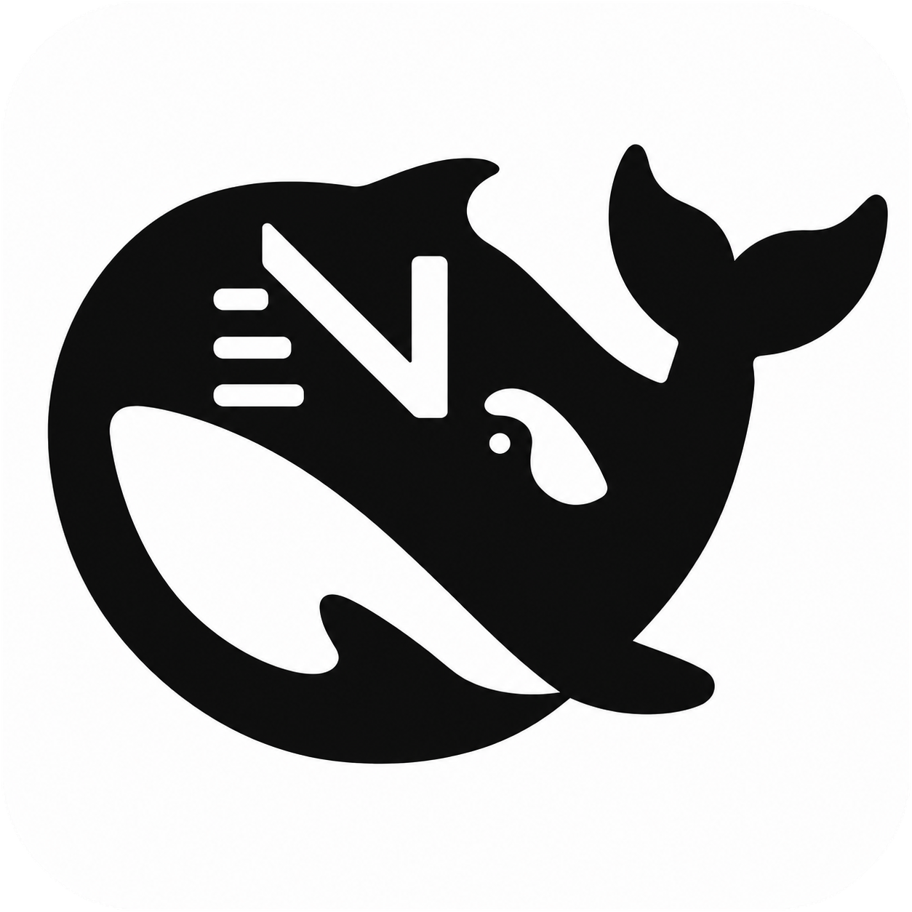
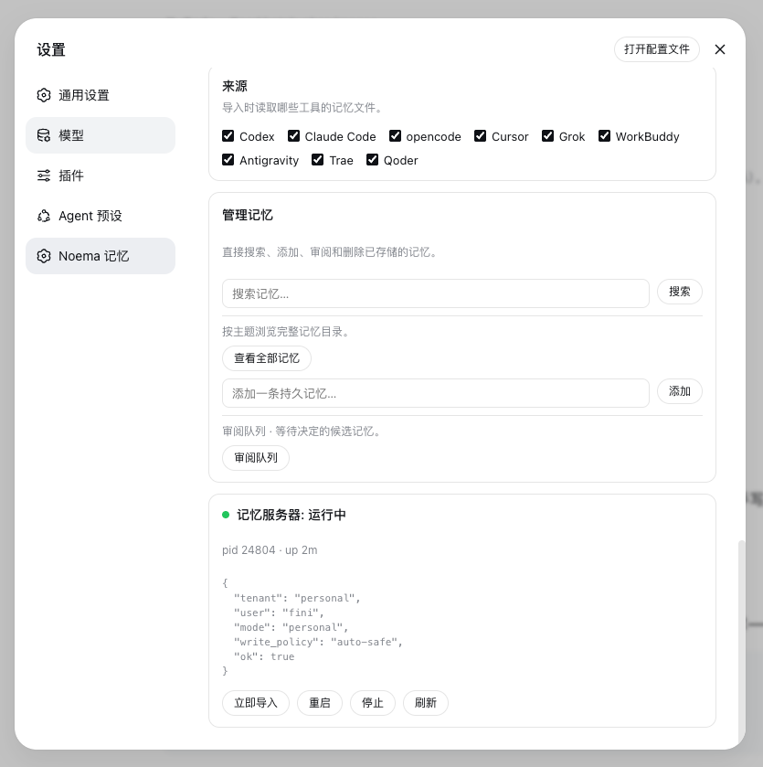

<p align="center">
  
</p>

<h1 align="center">DSH Noema</h1>

<p align="center">
  <strong>Long-term memory for DeepSeek Harness — durable, inspectable agent memory backed by Noema.</strong><br />
  <sub>Recall Before Work &bull; Import From 9 Agent Tools &bull; Settings-Page Memory Management &bull; Crash Keep-Alive &bull; Hot Reload</sub>
</p>

<p align="center">
  <sub>npm: <a href="https://www.npmjs.com/package/@zseven-w/dsh-noema"><code>@zseven-w/dsh-noema</code></a> · Current plugin release: <code>0.1.0-rc.3</code> · Tested with DSH <code>0.1.1-rc.1</code></sub>
</p>

<p align="center">
  <a href="./README.md"><b>English</b></a> · <a href="./README.zh.md">简体中文</a> · <a href="./README.zh-TW.md">繁體中文</a> · <a href="./README.ja.md">日本語</a> · <a href="./README.ko.md">한국어</a> · <a href="./README.fr.md">Français</a> · <a href="./README.es.md">Español</a> · <a href="./README.de.md">Deutsch</a> · <a href="./README.pt.md">Português</a> · <a href="./README.ru.md">Русский</a> · <a href="./README.hi.md">हिन्दी</a> · <a href="./README.tr.md">Türkçe</a> · <a href="./README.th.md">ไทย</a> · <a href="./README.vi.md">Tiếng Việt</a> · <a href="./README.id.md">Bahasa Indonesia</a>
</p>

<p align="center">
  <a href="https://www.npmjs.com/package/@zseven-w/dsh-noema"></a>
  <a href="https://github.com/ZSeven-W/dsh-noema/stargazers"></a>
  <a href="https://github.com/ZSeven-W/dsh-noema/blob/main/LICENSE"></a>
</p>

<br />

<p align="center">
  
</p>
<p align="center"><sub>The Noema Memory settings page — import sources, memory management, and live server status</sub></p>

## Why DSH Noema

DSH Noema connects [DeepSeek Harness](https://github.com/deepseek-ai/deepseek-harness) with [Noema](https://github.com/ZSeven-W/noema) — a local-first, non-vector memory system for coding agents — so an Agent keeps durable knowledge across sessions instead of starting every conversation from zero.

<table>
<tr>
<td width="50%">

### 🧠 Durable Recall

Memories persist as inspectable Markdown files under `NOEMA_ROOT` (default `~/.agent-memory/`). `noema_recall` loads relevant context at the start of a session; `noema_search`, `noema_browse`, `noema_catalog`, and `noema_recall_graph` cover lookup, exploration, and auditing.

</td>
<td width="50%">

### 📥 Import From Other Tools

`noema_import` reads the memory files of ten other AI coding tools — Codex, Claude Code, opencode, Cursor, Grok, WorkBuddy, Antigravity, Trae, Qoder, Hermes — splits them into sections, and saves each as a durable memory. A content-keyed ledger deduplicates across runs and across tools that share files.

</td>
</tr>
<tr>
<td width="50%">

### 🛠️ Settings-Page Management

The Noema Memory settings page configures the server command, memory root, budgets, idle/call timeouts, and the guidance section — and a Manage memories card searches, browses, adds, reviews, and deletes stored memories directly.

</td>
<td width="50%">

### 🩺 Keep-Alive

The memory server stays up: idle timeout defaults to never, and a keep-alive loop restarts the `noema-mcp` child in the background when it crashes or exits, with a configurable check interval and restart backoff.

</td>
</tr>
<tr>
<td width="50%">

### 🔍 Smart Entity Extraction

Noema's extraction engine combines jieba word segmentation with high-precision signals — English proper nouns, CJK names and technical terms, quoted topics, and repetition — with stopword and path filters, so the PageIndex topic catalog stays clean.

</td>
<td width="50%">

### ⚡ Hot Reload

After the first boot, the plugin never needs a restart again: `pnpm run build` hot-reloads the host plugin through Cordis HMR, and `ppnpm run build:client` hot-swaps the browser bundle over the client-hmr SSE channel.

</td>
</tr>
</table>

## Install into DSH

```sh
dsh plugin --profile web add @zseven-w/dsh-noema@latest
dsh web
```

Or, for local development straight from the source tree:

```sh
dsh plugin --profile web add link:/path/to/dsh-noema
dsh web
```

The `link:` protocol symlinks the profile dependency to this repository, so rebuilds are visible immediately and Cordis HMR can watch the compiled output.

The plugin bundles the `noema-mcp` binary through per-platform optional npm packages. To build it yourself instead, run `cargo build --release -p noema-mcp` inside the bundled `noema` submodule, or point the Server command setting at any `noema-mcp` build.

## Memory Tools

The model-facing tools mirror the Noema MCP surface:

| Tool | What it does |
| --- | --- |
| `noema_recall` | Recall relevant memories for a query, with a token budget. |
| `noema_search` | Full-text search over stored memories. |
| `noema_browse` | Browse the PageIndex catalog for a topic or entity. |
| `noema_catalog` | Render the full memory catalog as markdown. |
| `noema_recall_graph` | Multi-hop recall through links and shared entities. |
| `noema_neighbors` | One graph hop from a memory. |
| `noema_explain` | Explain why a memory was or was not recalled. |
| `noema_remember` | Save a durable fact, decision, constraint, or preference. |
| `noema_review_list` | List pending review candidates. |
| `noema_review_decide` | Accept, reject, edit, or merge a candidate. |
| `noema_forget` | Tombstone or hard-delete a memory. |
| `noema_policy_get` / `noema_policy_set` | Read or update the write policy. |
| `noema_status` | Server and tenant status: counts, index health, storage root. |
| `noema_import` | Import memories from other AI coding tools. |

Each tool returns a uniform envelope `{ ok, tool, text }` where `text` carries the full server output.

## Import memories from other tools

| Source id | Global files | Workspace files |
| --- | --- | --- |
| `codex` | `~/.codex/AGENTS.md` + the Codex memory pipeline: `~/.codex/memories/MEMORY.md`, `memory_summary.md`, `rollout_summaries/*.md`, `extensions/ad_hoc/notes/*.md` (`raw_memories.md` skipped — it is the uncurated feed) | `AGENTS.md`, `AGENTS.local.md` |
| `claude-code` | `~/.claude/CLAUDE.md`, `~/.claude/CLAUDE.local.md`, `~/.claude/MEMORY.md` | `CLAUDE.md`, `CLAUDE.local.md`, `MEMORY.md` |
| `opencode` | `~/.config/opencode/AGENTS.md` | `AGENTS.md` |
| `cursor` | `~/.cursor/rules/*.mdc`, `~/.cursorrules` | `.cursor/rules/*.mdc`, `.cursorrules` |
| `grok` | `~/.grok/AGENTS.md` + the Grok cross-session memory: `~/.grok/memory/MEMORY.md`, per-project `MEMORY.md`, and `sessions/*.md` summaries | `AGENTS.md` |
| `workbuddy` | `~/.codebuddy/CODEBUDDY.md` (WorkBuddy memory file), `~/.workbuddy/AGENTS.md`, `~/.workbuddy/memory.md`, `~/.config/workbuddy/AGENTS.md`, `~/Library/Application Support/WorkBuddy/AGENTS.md` | `AGENTS.md`, `CODEBUDDY.md` |
| `antigravity` | `~/.antigravity/AGENTS.md`, `~/.config/antigravity/AGENTS.md`, `~/Library/Application Support/Antigravity/AGENTS.md` (best-effort; no documented global memory store yet) | `AGENTS.md`, `AGENTS.local.md` |
| `trae` | `~/.trae/AGENTS.md`, `~/.trae/memory/`, `~/.trae/rules/` (plus the `~/.trae-cn` variants) | `AGENTS.md`, `.trae/rules/` |
| `qoder` | `~/.qoder-cn/AGENTS.md`, `~/.qoder-cn/rules/`, the auto-memory roots `~/.qoder-cn/memory/` and `~/.qoder-cn/projects/*/memory/` (plus `~/.qoder` variants) | `AGENTS.md`, `AGENTS.local.md`, `.qoder/rules/` |
| `hermes` | `~/.hermes/memories/` (`MEMORY.md` + `USER.md`) and the global `~/.hermes/SOUL.md` | `.hermes.md`, `HERMES.md`, `AGENTS.md`, `CLAUDE.md` |

- The `source` argument selects one tool, or omit it to run every source enabled in settings.
- The `path` argument selects the workspace root for project-scoped files (defaults to the session workspace; workspace files only load when the Import workspace files setting is on).
- Imports are deduplicated through a ledger at `$DSH_HOME/storages/dsh-noema-imports.json`, keyed by file path + section content — when several tools share one project `AGENTS.md`, each section is imported exactly once. `force: true` re-imports everything.
- The settings page exposes per-source checkboxes, an import-on-startup toggle, a file-size cap, and an Import now button with a last-run summary.

## Settings

Open **Settings → Noema Memory**:

| Setting | Default | Meaning |
| --- | --- | --- |
| Enable memory | on | Master switch for the `noema_*` tools. |
| Memory guidance | on | System-prompt section teaching memory usage. |
| Start server at boot | on | Spawn at DSH start instead of first use. |
| Auto-accept new memories | on | `noema_remember` persists immediately. |
| Server command | `bundled` | Bundled `noema-mcp` binary or a custom executable path/command. |
| Working directory | — | cwd for the server (needed for `cargo run`). |
| Memory root (NOEMA_ROOT) | — | Where memories are stored; empty = `~/.agent-memory`. |
| Recall token budget | 1200 | Default `budget_tokens` for `noema_recall`. |
| Idle timeout (ms) | 0 | Stop the server after idle; 0 = never. |
| Keep alive | on | Restart the server in the background when it crashes or exits. |
| Keep-alive interval (ms) | 5000 | Minimum delay between background health checks. |
| Call timeout (ms) | 30000 | Per-tool-call deadline. |
| Restart delay (ms) | 1000 | Backoff between a stop/crash and the next start. |

The status card shows server health with restart/stop actions, and the import section manages the nine memory sources.

## Hot reload

DSH's HMR machinery is fully usable once the plugin has been loaded once:

- **Host plugin** — enable the Cordis HMR entry in the profile patch with its watch root pointed at this package's `lib/` output, and keep the `link:` dependency. Run `pnpm run build` and the running DSH reloads the plugin entry automatically (the Noema server child is restarted by the reload) — no server restart.

  ```yaml
  # ~/.dsh/profiles/<profile>/cordis.patch.yml
  - id: hmr
    disabled: false
    config:
      root:
        - /path/to/dsh-noema/lib
  ```

- **Client bundle** — `ppnpm run build:client` rewrites `lib/client.js`; the client-hmr node half stat-polls every graph bundle (default 500ms) and broadcasts a `rebuilt` frame over the `/plugins/events` SSE channel, and the browser hot-swaps the module without a page refresh.
- **Settings** — every change made on the Noema Memory settings page applies live through the settings service.

The one thing hot-reload cannot do is load a plugin that was never in the booted tree: the running composition neither watches the profile patch layer (the web app does not wire `watchUserPatches`) nor exposes a loader mutation API (the plugin inventory RPC is read-only). A fresh plugin therefore needs exactly one server restart, after which the loop above is fully hot.

## Develop

```sh
pnpm install
pnpm run build     # host tsc + client tsdown bundle
pnpm test          # build + node --test tests/
```

The e2e test runs against `noema/target/debug/noema-mcp` when present (it is skipped otherwise).

## Ecosystem

- [DSH Android](https://github.com/ZSeven-W/dsh-android) — a live Android emulator or USB device inside the conversation, driven entirely through adb
- [DSH Crew](https://github.com/ZSeven-W/dsh-crew) — dispatch work to DSH agents from Claude Code / Codex
- [DSH iOS](https://github.com/ZSeven-W/dsh-ios) — a live iOS Simulator and a USB-connected iPhone, inside the conversation
- [DSH OpenPencil](https://github.com/ZSeven-W/dsh-openpencil) — inspect and edit `.op` design documents inside a conversation

## License

MIT

