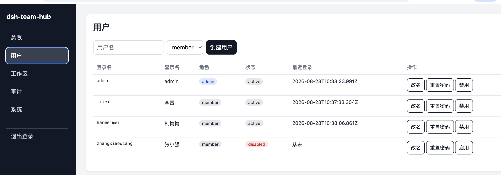

# dsh-team-hub

把单用户的 [DeepSeek Harness](https://github.com/deepseek-ai/DeepSeek-Harness) Web 实例，变成局域网内可安全共用的团队服务。

dsh-team-hub 位于浏览器和本地 DSH 实例之间。它不修改 DSH，而是在外层提供登录、角色、工作区隔离、RPC 过滤、WebSocket 事件过滤、Admin 控制台和审计日志。

[English README](README.en.md)



> **dsh-team-hub 是一个面向团队的 DSH 协作网关。** 管理员可以统一管理成员、工作区、权限和审计记录；团队成员在各自隔离的工作区中共享同一个 DSH 服务，不再把个人机器上的单用户环境直接暴露给所有人。

> 当前版本：v0.2.7。专注于安全共享访问、团队成员管理、工作区隔离和可审计的协作体验。

## 为什么需要它

DSH Web 默认是单用户形态，通常只监听本机回环地址。直接把 DSH 地址分享给团队成员，会让所有人都获得同一个高权限宿主上下文。

dsh-team-hub 提供：

- 用户名/密码登录
- 首次登录强制修改密码
- Admin / Member / Disabled 角色状态
- 按成员隔离工作区和会话
- DSH RPC 默认拒绝策略
- WebSocket 事件逐帧过滤
- 共享知识库和代码仓库目录
- 独立 Admin 控制台
- 结构化审计日志
- macOS launchd / Linux systemd 服务安装
- DSH 兼容性自检

## 环境要求

- Node.js 22 或更高版本
- 一个可访问的 DSH Web 实例，默认 `http://127.0.0.1:3080`
- macOS 或 Linux（用于系统服务安装）
- 可信局域网。v0.1 不建议直接暴露到公网

## 快速开始

```bash
npm install -g dsh-team-hub

dsh-team-hub init alice bob
dsh-team-hub start
```

初始化时会打印一次 admin 初始密码。打开：

```text
http://<服务器局域网IP>:3090
```

Admin 控制台：

```text
http://<服务器局域网IP>:3090/admin
```

所有用户使用初始密码首次登录后，都必须设置新密码。

## CLI

```bash
dsh-team-hub init [--port 3090] [--upstream http://127.0.0.1:3080] [member ...]
dsh-team-hub start
dsh-team-hub selftest
dsh-team-hub user add <name> [--role member|admin]
dsh-team-hub user disable <name>
dsh-team-hub user enable <name>
dsh-team-hub user reset-password <name>
dsh-team-hub patch status [--dsh-root <path>]
dsh-team-hub patch apply [--dsh-root <path>]
dsh-team-hub patch rollback [--dsh-root <path>]
dsh-team-hub service install
dsh-team-hub service status
dsh-team-hub service uninstall
```

### 远程设置补丁（patch）

dsh 上游把 settings 设计为仅本机（loopback）可用：通过局域网 IP/域名访问时，
设置页会报「加载提供方目录失败: settings are unavailable in this browser」
（dsh 上游 0.1.1-rc.2 回归）。dsh-team-hub 启动时会自动给 dsh 客户端打补丁，
把 settings 强制为 host 模式（幂等，dsh 升级后重启网关自动重打）。

```bash
dsh-team-hub patch status    # 查看补丁状态
dsh-team-hub patch apply     # 手动应用
dsh-team-hub patch rollback  # 回滚（恢复 dsh 原始文件）
```

找不到 dsh 安装目录时，用 `--dsh-root <path>` 显式指定，或在 config.json 里设置
`"dshRoot": "<path>"`。

运行数据默认保存到：

```text
~/.dsh-team-hub
```

可以通过环境变量修改：

```bash
export DSH_TEAM_HUB_HOME=/path/to/data
```

## 安全模型

- Member 未明确允许的 DSH RPC 方法默认拒绝
- 未识别的 WebSocket 事件类型默认丢弃
- 所有受保护参数都会校验会话/工作区归属
- Member 可见列表只包含自己的资源
- 宿主文件选择、系统设置、凭证、工作区创建/删除等特权方法对 Member 禁用
- 密码使用 scrypt 哈希
- 配置和会话文件权限为 0600
- 审计日志会脱敏 password/token/secret/api-key 类字段

完整威胁模型见 [docs/security.md](docs/security.md)。

## Admin 控制台

控制台由网关提供，地址为 `/admin`：

- 总览
- 用户创建、禁用、启用、重置密码
- 工作区归属查看
- 审计查询
- 系统状态和 DSH 兼容性自检

Member 继续使用正常的 DSH 界面，不需要理解网关内部实现。

## 共享目录

运行目录中包含：

```text
shared/knowledge
shared/repo
```

它们是 Member Agent 可读取的基础共享位置。团队资产的发布、版本化和自动注入计划在 v0.2 实现。

## 升级 DSH 后

DSH 的 RPC 和事件协议仍属于内部协议，升级后可能变化。请运行：

```bash
dsh-team-hub selftest
npm test
```

未识别的新 DSH 方法会默认拒绝。这样升级后最多导致新功能暂时不可用，而不会意外泄露其他成员的数据。

## 路线图

### v0.2 — 团队知识进化

- 成员提交候选资产
- Admin 审阅并发布
- 版本管理和回滚
- AGENTS、提示词、Skills、模板
- 自动注入到成员会话
- 使用效果反馈

### 后续版本

- Codex / KimiWork 会话只读聚合
- 团队使用统计
- HTTPS 反向代理部署模板
- 多 DSH 主机管理

## 免责声明

这是独立社区项目，不是 DeepSeek 官方产品。

## License

MIT
